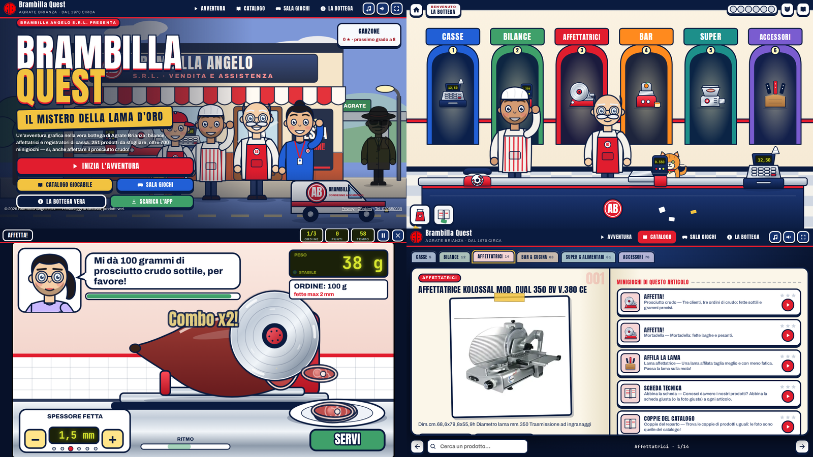

# Brambilla Quest — Il mistero della Lama d'Oro

<p align="center">
  <a href="https://cammo22.github.io/Brmbll/">
    
  </a>
  <a href="https://github.com/cammo22/Brmbll/releases/latest">
    
  </a>
</p>

<p align="center">
  
</p>

Il sito di **Brambilla Angelo s.r.l.** (vendita e assistenza di bilance, affettatrici, registratori di cassa, macchinari
e accessori per negozi — Via Lecco n. 16, Agrate Brianza) diventato un'**avventura grafica**:
personaggi, trama, dialoghi, inventario, indizi e un mare di minigiochi.

Tutto il gioco è HTML + CSS + JavaScript senza framework né dipendenze: grafica disegnata in SVG/Canvas,
musica ed effetti sintetizzati con WebAudio. Funziona dal browser, si installa come PWA e ha due pacchetti
nativi: **Android (APK)** e **Windows portatile (.exe)**.

## Che cosa c'è dentro

- **L'avventura** — «Il mistero della Lama d'Oro»: prologo, sei capitoli (uno per reparto), lavagna degli indizi
  e finale con inseguimento in furgone, duello di affettatura e festa dei 50 anni. Dialoghi con ritratti parlanti,
  scelte, inventario, telefonate misteriose e un gatto di bottega (Fetta) che dà i consigli.
- **Il catalogo giocabile** — un libro da sfogliare con i **251 articoli** dei cataloghi PDF (foto, nome e scheda
  tecnica veri). Ogni articolo ha i *suoi* minigiochi (da 4 a 6), scelti in base al prodotto.
- **La sala giochi** — tutti i 18 motori di minigioco con le loro varianti (oltre 50), grado da garzone a
  «Leggenda di Agrate» e una sfida del giorno.
- **La bottega vera** — chi siamo, prodotti, servizi, marchi, consegne, offerte, dove siamo, contatti,
  cataloghi PDF, informativa privacy e cookie: tutti i contenuti reali del sito.

### I minigiochi

| Motore | Dove lo trovi |
|---|---|
| **Affetta!** — prosciutto crudo, cotto, speck, salame, mortadella, bresaola, formaggio: carrello, spessore, ritmo e grammi sulla bilancia | affettatrici, morsa per prosciutto, duello finale, taglio di mezzanotte |
| Gira il volano · Affila la lama | affettatrici a volano, affilacoltelli, coltelleria |
| Tieni e rilascia (pesa giusto, bricco, sottovuoto, ghiaccio, olio) · Ferma la lancetta (taratura, sigillo, forno) | bilance, sottovuoto, cucina |
| Il peso falso (bilancia a due piatti) | bilance |
| Taglia al volo (frutta, verdure, ghiaccio, salumi) | centrifughe, frullatori, tagliaverdure |
| Dai il resto · Scontrino lampo · Ripeti la sequenza | registratori di cassa, rotoli, segnaprezzi |
| Impila al volo · Coppie del catalogo | carrelli, pentolame, contenitori, tutto il catalogo |
| Taglia sulla linea (segaossa, pane, pizza) · Tritacarne sicuro | segaossa, tritacarne, hamburgatrici |
| Lucida l'inox · Monta i pezzi · Consegna a domicilio | lavelli, forni, tritacarne, furgone |
| Scheda tecnica · Indovina la foto (generati dai dati del catalogo) | ogni articolo |

Comandi: **touch** (tocca, trascina, scorri), **mouse** e **tastiera** (frecce, spazio, invio, Esc per la pausa).
I progressi e le stelle si salvano nel browser (o nell'app).

## Giocare e installare

| Dove | Come |
|---|---|
| Browser | <https://cammo22.github.io/Brmbll/> — funziona anche offline (PWA, «Installa app») |
| Android 7.0+ | `Brambilla-Quest-Android.apk` dalle [release](https://github.com/cammo22/Brmbll/releases/latest) |
| Windows 64 bit | `Brambilla-Quest-Windows-Portable.exe` dalle [release](https://github.com/cammo22/Brmbll/releases/latest) — portatile, nessuna installazione |

## Struttura

```
index.html                    shell dell'app (+ testo per i motori di ricerca)
manifest.webmanifest, sw.js   PWA
informativa-privacy.html      informativa privacy
cookies.html                  informativa cookie
assets/css/game.css           tutto lo stile
assets/js/core.js             utilità, salvataggio, rango
assets/js/audio.js            effetti e musica (WebAudio)
assets/js/art-*.js            personaggi, oggetti e scene SVG
assets/js/ui.js               dialoghi, modali, toast
assets/js/mini.js             guscio dei minigiochi + utilità di disegno
assets/js/games-{a,b,c}.js    i 18 motori di minigioco
assets/js/items.js            251 articoli → minigiochi per articolo
assets/js/adventure.js        motore point & click
assets/js/story.js            la storia, i capitoli, il finale
assets/js/catalog.js          il libro del catalogo
assets/js/screens.js          menu, sala giochi, info bottega
assets/data/catalog-data.js   i 251 articoli estratti dai PDF
assets/cat/                   foto dei 251 articoli
assets/pdf/                   cataloghi PDF
native/electron/              guscio Electron (Windows)
android/                      progetto Capacitor (Android)
.github/workflows/release.yml build e pubblicazione delle release
```

## Sviluppo

```bash
python3 -m http.server 8123      # poi apri http://localhost:8123
npm install
npm run electron                 # prova la versione desktop
npm run android:sync             # copia il sito nel progetto Android
```

Le release si producono da GitHub Actions: **Actions → Release → Run workflow** (tag `v1.0.0`), oppure
`git tag v1.0.1 && git push --tags`. Il workflow compila l'APK (Android, JDK 21) e l'eseguibile portatile
(Windows, Electron) e li allega alla release.

**Firma Android.** Senza segreti l'APK è firmato con il keystore di debug incluso nel repository (firma stabile
tra le release, installabile ovunque). Per una firma di produzione imposta i secret `ANDROID_KEYSTORE_BASE64`,
`ANDROID_KEYSTORE_PASSWORD`, `ANDROID_KEY_ALIAS`.

## Note

- I personaggi e la trama sono di fantasia; prodotti, marchi, servizi e recapiti sono quelli veri dell'azienda.
- Il modulo contatti apre il client di posta con i campi compilati (`mailto:` verso `brambilla.srl@virgilio.it`).
- Nelle app i PDF dei cataloghi si aprono dal sito online (per non appesantire il pacchetto).
- Font (Anton, Archivo, JetBrains Mono) inclusi in locale: nessuna richiesta a Google Fonts.
